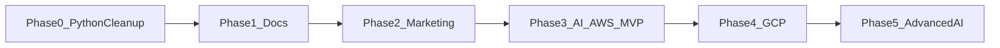

# ForgeArc Structured Launch Plan

## Launch sequence

Phases 1 and 2 can launch Node and Python commercially while Phase 3 is still in progress. The AI checkout stays disabled until Phase 3 acceptance criteria pass.

## Phase 0 — Python persistence cleanup

[`python-cloud-arc`](python-cloud-arc) has no Prisma dependency, schema, or client. Persistence is already SQLAlchemy, SQLModel, and Alembic. The only Prisma references are comments and docs that compare Python DI with the Node kit, including [`python-cloud-arc/api/layers/shared/python/src/core/di.py`](python-cloud-arc/api/layers/shared/python/src/core/di.py), [`python-cloud-arc/docs/CSR-AND-DI.md`](python-cloud-arc/docs/CSR-AND-DI.md), and [`python-cloud-arc/docs/ARCHITECTURE.md`](python-cloud-arc/docs/ARCHITECTURE.md).

- Rewrite those references in Python-only terms: `SESSION_FACTORY`, SQLAlchemy sessions, SQLModel models, and Alembic migrations.
- Leave Prisma in [`node-cloud-arc`](node-cloud-arc), where it is the real data layer.
- Confirm `pyproject.toml`, layer requirements, and imports contain no Prisma packages.

## Phase 1 — Documentation site

Add [`docs-site/`](docs-site/) at the repository root as the public documentation app for all three products. Keep each kit’s source docs beside its code, and have VitePress consume them through a shared theme.

- Sections: Node CloudArc, Python CloudArc, and ForgeArc AI, plus shared getting started, architecture, security, API, and deployment pages.
- Use VitePress with a custom theme, searchable sidebar, versioned product sections, and Mermaid for sequence and request flows.
- Build reusable diagram components that place official AWS Architecture Icons and Google Cloud product icons on architecture drawings. Vendor the SVG sets locally and follow each vendor’s trademark and icon-usage rules.
- Publish the existing Node and Python docs first. Add ForgeArc AI pages as stubs during this phase, then fill them from the kit as Phase 3 lands.
- Local command: `npm run docs:dev`. Deploy the static site independently of the product kits.

## Phase 2 — Marketing site and commerce

Add [`marketing-site/`](marketing-site/) as a separate frontend app, with a small commerce API for checkout, entitlements, and delivery. The commercial source of truth is the ForgeArc AI requirement document, reconciled into one `commercial/catalog.yaml` because it conflicts with the older prices in [`python-cloud-arc/docs/PRICING.md`](python-cloud-arc/docs/PRICING.md).

Catalog to encode:

- Free: CLI and core, local development, OpenAI path.
- Starter AWS or GCP: ₹3,999 / $48, one cloud adapter.
- Professional: ₹9,999 / $120, both adapters, lifetime updates, and the documented support allowance.
- Agency: ₹24,999 / $299, multi-project use and setup support.
- Enterprise: ₹79,999 / $960, team license, custom adapter, SLA, and workshop.
- Suite: ₹29,999 / $360, Node, Python, and AI kits.

Site scope:

- Product, feature, comparison, pricing, and documentation pages, with one primary purchase CTA and a secondary documentation CTA.
- Region-aware checkout: Razorpay for India billing and Stripe for international billing. Webhooks create the order, entitlement, and delivery job only after confirmed payment.
- A live purchase toast fed by confirmed Stripe and Razorpay orders. Fabricated buyer popups are excluded.
- Consent-based lead capture: analytics for anonymous sessions, and email or WhatsApp follow-up only after the visitor submits contact details and opts in. Store consent, source page, and bounce/session events for those leads.
- Post-purchase email with the plan name, access link, setup order, configuration checklist, and the first successful local-run steps.
- Delivery is plan-gated and private: license key bound to the buyer email, private repository invite or signed download, buyer-only docs, and license headers in paid adapters. Free content stays public; paid adapters and higher-tier support are never placed in the public repository. Access is revoked or rotated when a license is refunded.

Phase 2 acceptance: a test payment through each provider creates an entitlement, sends the onboarding email, and grants only the artifacts included in that plan.

## Phase 3 — ForgeArc AI AWS MVP

Create [`forgearc-ai/`](forgearc-ai/) without modifying the cleaned Python kit except for reusable patterns copied from it. Use `packages/core`, `packages/aws_adapter`, and `apps/api`, with FastAPI locally and Python CDK on AWS. Keep Controller, Service, Repository, lightweight DI, decorator routing, generated OpenAPI and manifest, and JWT, RBAC, and module gates.

- Typed `forgearc-ai.yaml` configuration. Missing production credentials fail startup.
- Provider contracts for chat, streaming, embeddings, vector search, documents, memory, jobs, tools, tracing, tokens, and cost policy.
- Real OpenAI and Bedrock adapters, model allowlists, structured output, token accounting, Secrets Manager, and least-privilege IAM.
- Tenant-scoped RAG: Alembic migrations, document loaders, chunking, embeddings, local pgvector, citations, and corpus deletion.
- APIs for buffered chat, SSE streaming, upload and ingestion, retrieval, job status, usage, and deletion. Local routing comes from the generated manifest.
- SQS workers, idempotent jobs, retries, DLQ alarms, status polling, and signed webhooks.
- Quotas, budget gates, rate limits, prompt limits, moderation and tool allowlists, PII-safe logs, and audit fields.
- Tests, CI, CDK synth, reproducible release artifacts, recipes, sample client, and a gated AWS staging smoke test.

AWS MVP acceptance: a clean checkout can authenticate, ingest a document, stream a real model answer with citations, and report token cost. Checkout for the AI plans turns on only after this passes.

## Phase 4 — GCP edition

Add `packages/gcp_adapter` and Terraform for Vertex AI, Cloud Storage, Pub/Sub, Firestore, and the selected vector service. Update the docs diagrams and enable the GCP Starter plan. Application code stays on the same core interfaces used by AWS.

## Phase 5 — Advanced AI

Add LangGraph agents, human-approval APIs, the multi-agent supervisor, evaluation with RAGAS, and the richer cost dashboard. Voice AI, Deep Agents, Copilot, and subscriptions stay out until they have their own product spec and pricing rules.
