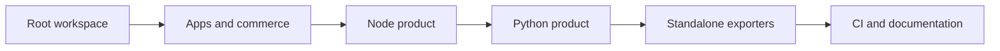

# ForgeArc Polyglot Monorepo Restructure

## Target structure

```text
Cloud-Arc-V2/
├── apps/
│   ├── docs/                    # current docs-site
│   └── marketing/               # current marketing-site
├── services/
│   └── commerce/                # checkout, entitlements, onboarding
├── products/
│   ├── cloudarc-node/
│   │   ├── apps/api/            # host, dev server, generated contracts
│   │   ├── packages/shared/     # Lambda layer, Prisma schema/client
│   │   ├── modules/             # platform, demo, files, ai
│   │   ├── infra/cdk/
│   │   ├── docs/
│   │   └── package.json
│   ├── cloudarc-python/
│   │   ├── apps/api/            # FastAPI host and Lambda entrypoints
│   │   ├── packages/shared/src/ # router, DI, SQLAlchemy, middleware
│   │   ├── modules/             # platform, demo, files, ai
│   │   ├── migrations/          # Alembic
│   │   ├── infra/cdk/
│   │   ├── docs/
│   │   ├── pyproject.toml
│   │   └── uv.lock
│   └── forgearc-ai/             # reserved for the next phase
├── packages/
│   ├── commercial-catalog/      # current catalog.yaml, no paid source
│   └── web-config/              # internal-only shared web lint/TS config
├── tooling/
│   ├── release/                 # standalone product exporters
│   └── scripts/
├── product-specs/               # current Requirement-docs
├── pnpm-workspace.yaml
├── turbo.json
├── pyproject.toml               # uv workspace membership and shared dev policy
├── uv.lock
└── package.json                 # root task entrypoint only
```

Root apps may use internal root packages. Product source must not import from `apps/`, `services/`, or root-only packages. Release exporters copy one product and generate the minimal workspace metadata it needs, so a buyer can install it without this repository.

## Migration steps

1. **Establish root governance.** Add `pnpm-workspace.yaml`, pinned `packageManager`, `turbo.json`, root `pyproject.toml` with uv workspace members, `.editorconfig`, normalized ignore rules, and root commands for `dev`, `build`, `lint`, `test`, and `typecheck`. Replace the competing root/subfolder npm lock strategy with pnpm locks, make uv the only documented Python environment/dependency runner, and document Node 20+, Python 3.12, pnpm, and uv in a root README.
2. **Move internal applications.** Use history-preserving moves from [`docs-site/`](docs-site/) to `apps/docs`, [`marketing-site/`](marketing-site/) to `apps/marketing`, [`commerce/`](commerce/) to `services/commerce`, [`commercial/`](commercial/) to `packages/commercial-catalog`, and [`Requirement-docs/`](Requirement-docs/) to `product-specs`. Update catalog paths, Vite proxies, root scripts, CORS defaults, docs links, and local ports.
3. **Normalize CloudArc Node.** Move [`node-cloud-arc/`](node-cloud-arc/) into `products/cloudarc-node` and split its current `api/layers/shared/nodejs` and `api/modules/*` into explicit `packages/shared` and `modules/*` workspace packages. Move CDK to `infra/cdk`; update TypeScript path aliases, esbuild/layer assembly, Prisma paths, manifest/OpenAPI discovery, CDK asset paths, Docker commands, and tests. Remove script pseudo-keys such as `"======== BUILD COMMANDS ========"`; expose standard package tasks instead.
4. **Normalize CloudArc Python and complete the uv migration.** Move [`python-cloud-arc/`](python-cloud-arc/) into `products/cloudarc-python`; make `apps/api`, `packages/shared`, `modules/*`, and `infra/cdk` explicit uv members while keeping SQLAlchemy/SQLModel/Alembic only. Move Alembic to `migrations` and CDK to `infra/cdk`; update Python imports, package discovery, manifest/OpenAPI discovery, FastAPI handler discovery, Alembic paths, CDK assets, Compose, tests, and docs. Replace `python -m venv`, direct `pip install`, bare `pytest`, bare `ruff`, bare `alembic`, and bare `uvicorn` commands with `uv sync`, `uv run pytest`, `uv run ruff`, `uv run alembic`, and `uv run uvicorn`. Replace CDK's `requirements.txt` workflow with a CDK `pyproject.toml` and uv lock. Build the Lambda layer from the lock with `uv export --frozen` plus `uv pip install --target`, so AWS still receives ordinary site-packages without exposing pip as a buyer workflow.
5. **Migrate commerce to uv.** Make [`commerce/`](commerce/) an explicit uv workspace member at `services/commerce`, commit its resolved dependencies to the root lock, and replace its checked-in/manual `.venv` assumptions with `uv sync --package forgearc-commerce`, `uv run --package forgearc-commerce pytest`, and `uv run --package forgearc-commerce uvicorn`. Keep commerce and the sellable Python product as separate packages in the same uv workspace.
6. **Preserve standalone products.** Replace [`scripts/pack-node.sh`](scripts/pack-node.sh) and [`scripts/pack-python.sh`](scripts/pack-python.sh) with deterministic release exporters under `tooling/release`. Each exporter will build/test first, copy only its product, exclude caches/generated secrets, include a product-local workspace manifest and lock, and run an install plus smoke test inside the staged artifact before creating the zip. The Python artifact includes `pyproject.toml`, `uv.lock`, and `uv sync --frozen` setup instructions; it does not include `requirements.txt` or pip-based setup instructions.
7. **Rebuild CI around affected work.** Replace product path-specific npm/pip workflows with root pnpm + Turbo and uv jobs: web apps, commerce, Node product, Python product, standalone-artifact smoke tests, and CDK synth. Install uv with its official action, enforce `uv lock --check`, run commands with `uv run`, cache pnpm and uv, and use Turbo filters so unrelated products do not rebuild.
8. **Update documentation and ownership.** Rewrite all paths and all Python commands in [`apps/docs`](docs-site), product READMEs, commerce onboarding artifacts, and marketing links. Add root architecture, contribution, release, and dependency-boundary documents plus CODEOWNERS for apps, commerce, and each product. Search the maintained repository for `pip install`, `python -m venv`, and activation commands; allow them only in an explicit migration note, never in current setup instructions.

## Task flow



Move one boundary at a time and keep the repository green after each stage. Do not combine the Node and Python framework implementations into a shared runtime package; parity remains contractual, not coupled source.

## Acceptance criteria

- `pnpm install`, `pnpm build`, `pnpm lint`, and `pnpm test` work from the repository root; Turbo shows the expected task graph.
- `uv sync --all-packages` and the root Python test command cover commerce and CloudArc Python without manual `PYTHONPATH` setup.
- `uv lock --check` passes; CloudArc Python, its Python CDK app, and commerce contain no supported setup path that calls pip or creates/activates a venv manually.
- The Lambda shared layer is reproducibly assembled from the frozen uv lock, and a deployed Lambda imports all runtime dependencies without uv being present in Lambda.
- Docs, marketing, and commerce work locally through root commands; the catalog has one canonical location.
- Node and Python product builds regenerate manifests/OpenAPI and their CDK stacks synthesize from the new paths.
- Each exported product installs and passes its own tests from a temporary directory with no access to root packages.
- The exported Python product succeeds with `uv sync --frozen` and its documented `uv run` commands from a clean temporary directory.
- Existing checkout entitlements, artifact ids, and buyer-facing commands point to the new product names and paths.