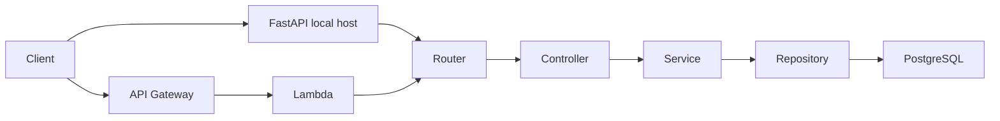

# ForgeArc Python quickstart

Use Python 3.12+ and uv. In a standalone product release:

```bash
docker compose up -d
cp apps/api/.env.example apps/api/.env
uv sync --all-packages --frozen
uv run --package forgearc-python-api alembic \
  -c migrations/alembic.ini upgrade head
uv run --package forgearc-python-api python apps/api/scripts/seed_admin.py
uv run --package forgearc-python-api uvicorn \
  --app-dir apps/api src.dev_server:app --reload --port 4001
```

Verify `GET http://localhost:4001/health`, then authenticate with
`POST /api/login`. Use the returned access token for protected module routes.

## How local and AWS execution match

The FastAPI development host discovers controllers under `modules/*`.
Manifest generation imports the same registrations and CDK creates one Lambda
per declared handler. Both paths use the router, DI container, middleware, and
SQLAlchemy session in `packages/shared/src`.



## Generate and deploy

```bash
uv run --package forgearc-python-api python apps/api/scripts/generate_manifest.py
uv run --package forgearc-python-api python apps/api/scripts/generate_openapi.py
uv run --package forgearc-python-api python packages/shared/scripts/build_layer.py
bash infra/cdk/scripts/deploy.sh dev synth
bash infra/cdk/scripts/deploy.sh dev deploy
```

The layer is assembled from `uv.lock` for Python 3.12 on Lambda ARM64.
