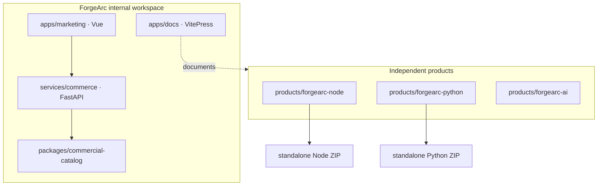

# Repository architecture

pnpm and Turborepo govern JavaScript packages. A single root uv workspace
governs commerce and the Python product packages. Node and Python implement the
same product contract independently; neither runtime imports the other.

Within each product, `apps/api` is the host, `packages/shared` is reusable
runtime infrastructure, `modules` contains sellable capabilities, and
`infra/cdk` deploys generated contracts and assets.
