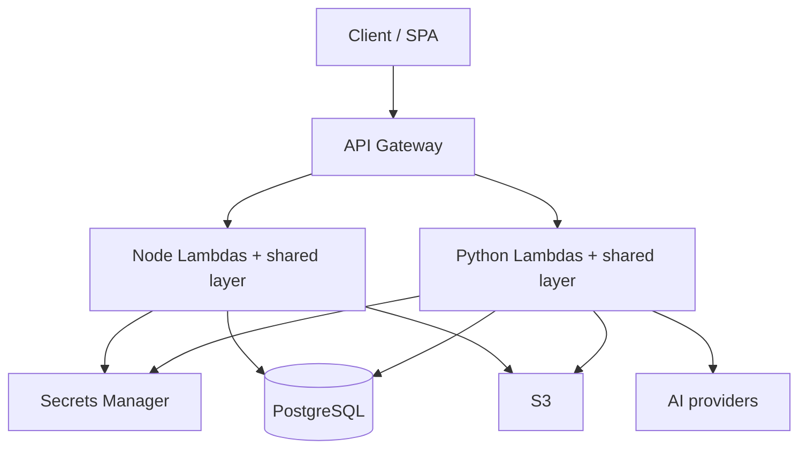

# ForgeArc Architecture

## Overview

ForgeArc is a modular AWS serverless ForgeArc sold as **Node** and **Python** kits with the same architectural shape.

## Request path (both languages)

1. API Gateway invokes a per-module Lambda.
2. Shared layer **handler factory** cold-starts DI/container once, caches router.
3. **Router** matches method/path from decorator registry.
4. Public routes skip JWT (`/api/login`, `/api/auth/refresh`, `GET /health`).
5. Authenticated routes: Bearer JWT → `@RequirePermission` → `@RequireModule`.
6. Controller → Service → Repository (CSR) via DI (`@inject` / `Inject(TYPES.…)`).
7. JSON envelope `{ success, data | error }`. `X-Request-Id` on every response.

## Shared layer modules

| Concern | Node | Python |
|---------|------|--------|
| Config | `layers/shared/nodejs/src/config` | `packages/shared/src/config` |
| DB | Prisma | SQLModel / SQLAlchemy |
| Decorators | reflect-metadata | registry decorators |
| DI | Inversify (`defineLambda` + `TYPES`) | `core/di.py` (`define_lambda` + `TYPES` + `Inject`) |
| CSR | `controllers/` `services/` `repositories/` | same folders per module |
| Router / handler factory | `core/` | `core/` |
| Auth / errors | `middleware/` | `middleware/` |
| JWT / secrets / S3 / logger | `utils/` | `utils/` |

See [LAYER-PARITY.md](LAYER-PARITY.md). CSR/DI: [CSR-AND-DI.md](CSR-AND-DI.md). Python spelling: `forgearc-python/docs/CSR-AND-DI.md`.

## Modules

- **platform** (required) — auth, users, roles, permissions, `GET /health`
- **demo** — tutorial CRUD `/api/demo/items` (paginated list)
- **ai** — chat stub / providers (Controller → Service)
- **files** — S3 presign upload/download

## Deploy

CDK under `infra/cdk/` reads `app-manifest.json` (Node host or Python `python/app-manifest.json`) to wire API Gateway routes to handlers.

## Local DX

- Node: Express `apps/api/src/dev-server.ts` → port 4000
- Python: FastAPI `python/src/dev_server.py` → port 4001
