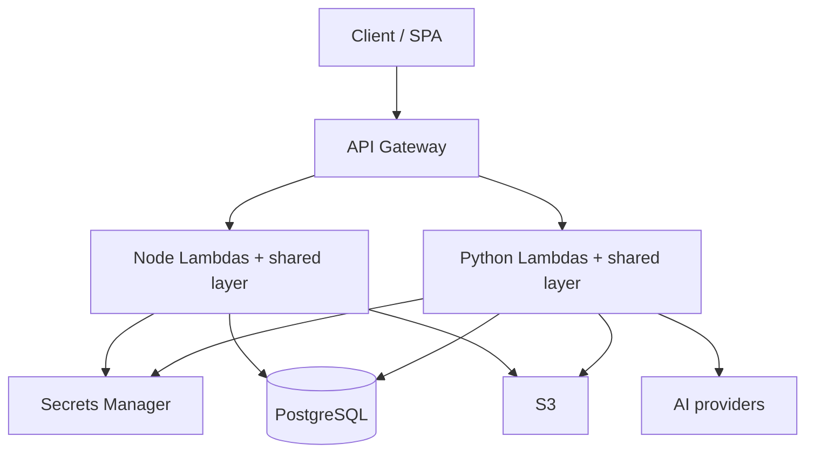

# ForgeArc Architecture

## Overview

ForgeArc is a modular AWS serverless ForgeArc sold as **Node** and **Python** kits with the same architectural shape.

## Request path (both languages)

1. API Gateway invokes a per-module Lambda.
2. Shared layer **handler factory** cold-starts DI/container once, caches router.
3. **Router** matches method/path from decorator registry.
4. Public routes skip JWT (`/api/login`, `/api/auth/refresh`, `GET /health`).
5. Authenticated routes: Bearer JWT → `@RequirePermission` → `@RequireModule`.
6. Controller → Service → Repository (CSR) via DI (`@inject` / `Inject(TYPES.…)`).
7. JSON envelope `{ success, data | error }`. `X-Request-Id` on every response.

## Shared layer modules

| Concern | Node | Python |
|---------|------|--------|
| Config | `layers/shared/nodejs/src/config` | `packages/shared/src/config` |
| DB | Node kit data client | SQLModel, SQLAlchemy, Alembic |
| Decorators | reflect-metadata | registry decorators |
| DI | Inversify (`defineLambda` + `TYPES`) | `core/di.py` (`define_lambda` + `TYPES` + `Inject`) |
| CSR | `controllers/` `services/` `repositories/` | same folders per module |
| Router / handler factory | `core/` | `core/` |
| Auth / errors | `middleware/` | `middleware/` |
| JWT / secrets / S3 / logger | `utils/` | `utils/` |

Python persistence uses SQLModel and SQLAlchemy. Schema changes ship as Alembic revisions.

See [LAYER-PARITY.md](LAYER-PARITY.md) and the Python CSR/DI guide: [CSR-AND-DI.md](CSR-AND-DI.md).

## Modules

- **platform** (required) — auth, users, roles, permissions, `GET /health`
- **demo** — tutorial CRUD `/api/demo/items` (paginated list)
- **ai** — chat stub / providers (Controller → Service)
- **files** — S3 presign upload/download

## Deploy

CDK under each kit’s `infra/cdk/` reads `apps/api/app-manifest.json` to wire API Gateway routes to handlers.

- Node kit: `pnpm build:manifest` (scans `@Controller` metadata)
- Python kit: `uv run --package forgearc-python-api python apps/api/scripts/generate_manifest.py` (same idea)

OpenAPI is generated from request schemas on build:

- Node: Zod + `pnpm build:openapi` → `apps/api/openapi/`
- Python: Pydantic `@ApiBody` + `uv run --package forgearc-python-api python apps/api/scripts/generate_openapi.py` → `apps/api/openapi/`

- Node kit: TypeScript CDK (`forgearc-node/infra/cdk`)
- Python kit: **Python CDK** (`forgearc-python/infra/cdk`, `aws-cdk-lib`)

## Local DX

- Node: Express `forgearc-node/apps/api/src/dev-server.ts` → port 4000
- Python: FastAPI `forgearc-python/apps/api/src/dev_server.py` → port 4001
